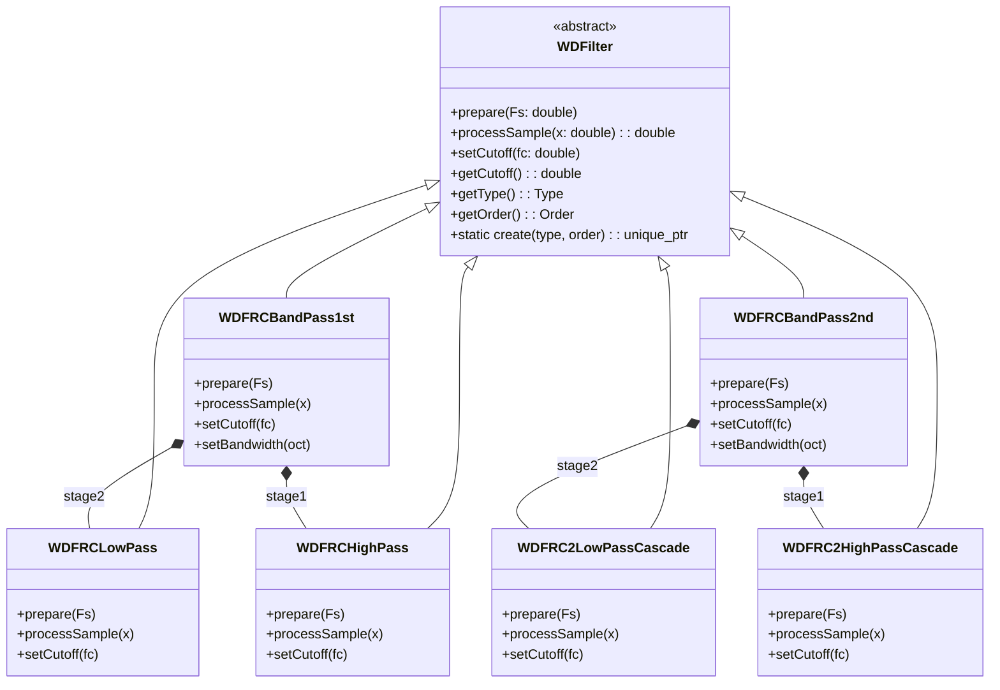

# wdf-sallenkey


## Install dependencies

```bash
mkdir -p build_external
cmake ../external
cmake --build .
```

## Build Plugin with CMake

Run the following commands to build the plugin in Debug mode. The plugin will be copied to the default install directory for VST3 plugins.

```bash
mkdir -p build_Debug
cd build_Debug
cmake .. -DCMAKE_PREFIX_PATH=${PWD}/../build_external/install
cmake --build .
```

## Build with Visual Studio Code

### VSCode: Build plugin with CMake
Create the `settings.json` file in the `.vscode` folder.
```json
{
    "cmake.configureSettings": {
        "CMAKE_PREFIX_PATH": [
            "${workspaceFolder}/build_external/install",
        ],
    "COPY_PLUGIN_AFTER_BUILD": "ON",

    },
    "search.exclude": {
        "build_*": true
    },
    "cmake.sourceDirectory": "${workspaceFolder}",
    "cmake.buildDirectory": "${workspaceFolder}/build_${buildType}",
}
```

### VSCode: Debug with DAW
Create the `launch.json` file in the `.vscode` folder.
```json
{
    "version": "0.2.0",
    "configurations": [
        {
            "name": "REAPER",
            "type": "lldb",
            "request": "launch",
            "program": "/Applications/REAPER.app/Contents/MacOS/REAPER",
            "args": [],
            "cwd": "${workspaceFolder}",
            "stopOnEntry": false,
            "console": "internalConsole",
            "internalConsoleOptions": "openOnSessionStart"
        }
    ]
}
```

## Build with Xcode
```bash
mkdir -p build_Debug
cd build_Debug
cmake .. -G Xcode -DCMAKE_PREFIX_PATH=${PWD}/../build_external/install
open SallenKeyPlugin.xcodeproj
```

## Build with Visual Studio
```bash
mkdir -p build_Debug
cd build_Debug
cmake .. -G "Visual Studio 17 2022" -B VS22 -T ClangCL -DCMAKE_PREFIX_PATH=${PWD}/../build_external/install
open SallenKeyPlugin.sln
```

## Running Frequency Response Analysis

### Python Implementation

The Python implementation of the frequency analyzer is located in the `prototypes/src` directory. To run it:

1. Make sure you have the required Python dependencies installed:
```bash
cd prototypes
pip install -r requirements.txt
```

2. Run the frequency analyzer:
```bash
python -m src.frequency_response_analyzer
```

This will:
- Create a `frequency_responses` directory
- Generate CSV files for all filter types (low-pass, high-pass, band-pass) for both 1st and 2nd order
- Save the frequency response data in these CSV files

### C++ Implementation

The C++ implementation of the frequency analyzer is located in the `analysis_cli` directory. To run it:

1. Build the analyzer:
```bash
cd build_Debug
cmake --build build_Debug --config Debug --target FrequencyResponseAnalyzer -j 12
```

2. Run the analyzer:
```bash
./build_Debug/analysis_cli/FrequencyResponseAnalyzer
```

This will:
- Create a `frequency_responses` directory
- Generate CSV files for all filter types (low-pass, high-pass, band-pass) for both 1st and 2nd order
- Save the frequency response data in these CSV files

The output files from both implementations can be compared to verify the filter behavior matches between Python and C++.

## Architecture Diagram



## Implementation Overview

The `WDFilter` base class defines a uniform interface for all wave-digital filters: methods for `prepare()`, `processSample()`, cutoff control, and runtime instantiation via `create()`. Concrete subclasses implement first- and second-order low-pass, high-pass, and band-pass filters:

- **First-Order Filters** (`WDFRCLowPass`, `WDFRCHighPass`):  
  Build on WDF elements (resistors, capacitors, series/shunt junctions) from the `chowdsp::wdft` library. Each filter computes its component values in `setCutoff()` using the standard RC formula  
  \[ R = \frac{1}{2\pi C f_c} \]  
  with a fixed \( C = 1\mu\text{F} \), and updates on sample-rate changes in `prepare()`.

- **Second-Order Cascades** (`WDFRC2LowPassCascade`, `WDFRC2HighPassCascade`):  
  Chain two identical first-order stages for a steeper 12 dB/octave slope per stage, achieving 24 dB/octave overall. Both stages share the same cutoff.

- **Band-Pass Filters** (`WDFRCBandPass1st`, `WDFRCBandPass2nd`):  
  Implemented by cascading a high-pass stage (`stage1`) followed by a low-pass stage (`stage2`). The center frequency (`cutoff`) and bandwidth (in octaves) determine individual HP/LP cutoffs via  
  \[
    f_{HP} = \frac{f_0}{\sqrt{2^{\text{BW}}}},\quad
    f_{LP} = f_0 \sqrt{2^{\text{BW}}}
  \]
  with clamping to \([20\text{ Hz}, 0.45\,\mathrm{Fs}]\). An optional auto-gain factor compensates for pass-band level loss.

Together, this hierarchy offers a flexible, WDF-based filter suite with runtime polymorphism, easy instantiation, and consistent behavior across filter types and orders.

